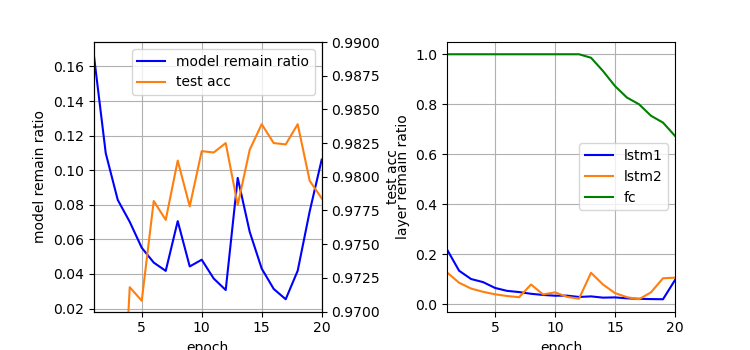
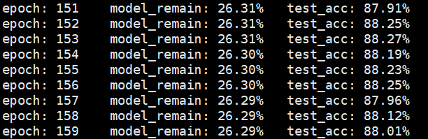
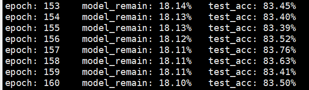

# Dynamic Sparse Training

复现 [Dynamic sparse training: Find efficient sparse network from scratch with trainable masked layers](https://arxiv.org/abs/2005.06870)

动态稀疏训练：通过从零开始训练带可训练的掩码的层来寻找高效的稀疏网络

---

## 摘要

作者提出了一种名为动态稀疏训练的网络剪枝方法，通过逐层设定可训练的剪枝阈值，可以同时训练网络和寻找稀疏结构。

其效果非常好，训练出的网络在极其稀疏的情况下依然能媲美原网络(dense)的表现。

作者还解释了该算法有效和高效的原因，对应于传统剪枝算法的缺陷。

## 1 Introduction

现有的稀疏训练（在训练中实施剪枝）方法存在以下问题：

    1. 预先设定的粗粒度的剪枝规划。需要众多超参数，例如一次剪枝a%的参数，然后微调b个epoch，总计c次剪枝；
    这些设定往往是固定的，无论需要修建的网络其结构复杂与否；此外，它们大多逐epoch进行剪枝。
    2. 不能恢复被剪掉的权重。作者认为一个网络中某层的权重的重要性会在训练和剪枝的过程中发生动态变化，直接将被剪掉的权重置为0将会损失其信息，
    而无法决定是否以及何时将其恢复，也不能判断该如何恢复（基本只是随机初始化或者初始化为相同值）。
    3. 不能正确设定逐层的剪枝率。作者认为网络中每层的冗余是相异的，因此在每层中使用使用相同的阈值来进行评估是不合理的，而现有的逐层剪枝方法效果不理想的 
    原因则在于，前面层中被修剪的不重要的神经元可能会对后面层造成显著的影响。

作者提出的方法可以解决以上所有问题：

    1.只需要一个超参数来决定模型最终的稀疏度；逐步(batch)进行剪枝（细粒度）。
    2.动态恢复权重；逐层设定阈值向量。
    3.逐层的剪枝率自动适应训练过程中权重重要性的变化。
    4. 发现在不同的模型稀疏度下，算法训练得到的网络各层具有相一致的稀疏模式。

---

## 2.相关工作

### 2.1传统剪枝算法

传统算法使用包括二阶导数、参数量级（大小）、一阶泰勒项等准则实施剪枝；此外，还使用l1正则化迫使不重要的参数归0。

### 2.2 稀疏训练

不依靠剪枝和微调，边训练边寻找稀疏网络。

    1.Mocanu 提出一种名为 Sparse Evolutionary Training 的剪枝再生方法，它允许随机恢复被修剪的神经元，
    但必须手动设定稀疏度，随机恢复也可能产生不好的影响。
    2.Bellec 使用贝叶斯采样来决定修剪和恢复，但计算过于复杂。
    3.Dynamic Sparse Reparameterization 使用动态的参数重新分配来探索稀疏结构，然而，其阈值只能减半和翻倍。
    4.Dynamic Network Surger 根据参数量级进行修剪和恢复，但它需要手动设定阈值，且在训练中是固定的。
    5. Dettmers & Zettlemoyer 提出稀疏动量(sparse momentum)，它根据指数平滑梯度来修剪和恢复，但其剪枝率和动量缩放率的搜索空间非常大。

---

## 3. DST

### 3.1 符号

网络共计 C 层，其中 W_i 表示第i层的权重矩阵。对于全连接层和循环层，W_i 大小为 (c_o, c_i)；对于卷积层，W_i 大小是 (c_o, z)，其中 z=c_i*w*h。

每个 W_i 具有一个相同大小的掩码 M_i，其中元素只能是 0 或 1。

### 3.2 阈值向量和动态参数掩码

剪枝可以看成将 M 应用于 W。掩码 M 保存了稀疏结构的信息。

对于每个 W_i，都有一个可训练的阈值向量 t，其大小为 c_o。这里，作者在附录 A.2 中讨论了阈值矩阵、阈值向量和阈值标量。

作者认为阈值标量不够鲁棒，而阈值矩阵占用了过多空间，使得网络参数量近乎翻倍，而阈值向量则很好地平衡了两者。此外，阈值向量的训练开销并不大，
它所增加的元素乘法(O(n^2))，相比于原本就有的批量矩阵乘法(O(n^3))不值一提。

如下所示，根据参数的量级和相应的阈值，并利用单位阶跃函数 S(x) 来获取掩码。


之后， 我们将 W 和 M 的 Hadamard 积作为稀疏权重矩阵，而不改变原本的 W。对于卷积层，先将卷积核展平以获取 M，之后将 M reshape 为卷积核的形状。

### 3.3 可训练的掩码层

将稀疏权重矩阵用于批量矩阵乘法，训练的前向和反向过程如下图所示。


为了使得阈值t可以被训练到，需要近似单位阶跃函数的导函数（直接采样导函数进行反向传播将无法训练），如下图所示。


作者最终采样上图 d 中所示的近似，其分段表达式如下图所示。


pytorch 实现如下。

```python
class UnitStepFunction(Function):
    @staticmethod
    def forward(ctx, inp):
        ctx.save_for_backward(inp)
        return (inp >= 0) * torch.ones_like(inp)

    @staticmethod
    def backward(ctx, grad_output):
        inp, = ctx.saved_tensors
        grad_input = grad_output.clone()

        abs_inp = torch.abs(inp)
        mask1 = (abs_inp <= 0.4)
        mask2 = (abs_inp > 0.4) & (abs_inp <= 1)
        res = (2 - 4 * abs_inp) * mask1 + 0.4 * mask2
        return grad_input * res


class UnitStepLayer(nn.Module):
    def __init__(self):
        super().__init__()

    def forward(self, x):
        out = UnitStepFunction.apply(x)
        return out
```

此外，作者在附录 A.3 中详细分析了权重矩阵和阈值向量的梯度来源。

### 3.4 稀疏正则项

想要使得掩码高度稀疏化，就要使用高阈值。这里使用稀疏正则项来对低阈值进行惩罚。

对于每一个阈值向量 t，其正则项为 R = sum(exp(-t_i))，而总的正则项为 Ls = sum(R_i)。

采用 exp 的原因是，希望正则项在阈值增加时趋向于0，但又不能过多鼓励它们变成一个过大的值。

### 3.5 动态稀疏训练

将网络中的全连接层、卷积层和循环层全部替换为可训练的掩码层（为每层中的参数设定阈值，计算 M 以获得稀疏的权重而不是使用原本的权重）。

总的损失函数如下图所示，通过设定超参数 alpha 来平衡模型的稀疏度和表现（alpha 决定模型最终的稀疏度）。


---

## 4. 实验

实验设定见附录 A.1

项目结构如下：
  - utils.py: 绘图工具，以及各实验的配置
  - dataload.py: 加载 minst 数据集和 cifar-10 数据集(增强)。
  - train.py: 训练网络，评估测试集精确率。
  - layers.py: 可训练的掩码层
  - models.py: 由掩码层组成的与原网络相当的网络

作者提出层（参数）剩余率，结合 3.3 掩码层和 3.4 稀疏正则项，我们首先设计一个掩码层的基类，确定其接口。

```python
class BaseMaskedLayer(nn.Module):
    def __init__(self):
        super(BaseMaskedLayer, self).__init__()
        self.usl = UnitStepLayer()
        self._ratio = torch.tensor([1.])
        self._weight_num = 0

    def forward(self, *args):
        raise NotImplementedError

    def get_sparse_term(self):
        return torch.sum(torch.exp(-self.thresholds))

    @property
    def weight_numel(self):
        return self._weight_num

    @property
    def remain_ratio(self):
        return self._ratio.item()
```

值得注意的是，作者在附录 A.1 中提到了一个 trick，当权重矩阵的稀疏度大于 99% 时，应当将阈值置为0， 作者认为这样会使得训练过程更加平滑，
且为稀疏度超参数 alpha 提供了更大的选择空间。我们会在每个掩码层的 forward 中，首先判断 self._ratio 是否小于0.01。

作者提出模型（参数）剩余率，为整合所有掩码层的剩余率，以及稀疏正则项，设计一个网络的基类，确定其接口。

```python
class BaseModel:
    def __init__(self, net):
        self.net = net
        self.init_parameters()

    def __call__(self, x):
        return self.net(x)

    def __getitem__(self, index):
        return self.net[index]

    def init_parameters(self, a=math.sqrt(5)):
        def init_weights(layer):
            if isinstance(layer, MaskedLinear):
                nn.init.kaiming_uniform_(layer.weight, a)
            elif isinstance(layer, MaskedConv2d):
                nn.init.xavier_normal_(layer.weight)

        self.net.apply(init_weights)

    def parameters(self):
        return self.net.parameters()

    def train(self):
        self.net.train()

    def eval(self):
        self.net.eval()

    def get_sparse_term(self):
        term = 0
        for layer in self.net:
            if isinstance(layer, BaseMaskedLayer):
                term += layer.get_sparse_term()
        return term

    def get_remain(self):
        weight_remain, weight_numel = 0, 0
        remain_ratios = []
        for layer in self.net:
            if isinstance(layer, BaseMaskedLayer):
                weight_remain += layer.weight_numel * layer.remain_ratio
                weight_numel += layer.weight_numel
                remain_ratios.append(layer.remain_ratio)
        return weight_remain / weight_numel, remain_ratios
```

### 4.1 MINST

作者给出了不同的网络在MINST数据集上剪枝的结果，如下图所示。


#### Lenet-300-100

Lenet-300-100 由3层全连接层组成，我们将其替换为对应的掩码层 MaskedLinear，其前向传播如下所示。

```python
    def forward(self, x):
        # t will be reset to zero if more than 99% elements in the mask are zero
        if self._ratio < 0.01:
            with torch.no_grad():
                self.thresholds.data.fill_(0.)

        Q = torch.abs(self.weight) - self.thresholds
        mask = self.usl(Q)

        self._ratio = torch.sum(mask) / self._weight_num

        masked_weight = self.weight * mask
        output = nn.functional.linear(x, masked_weight, self.bias)
        return output
```

实验设定：epoch, batch_size, lr = 20, 64, 0.01，alpha = 0.0005，优化算法为 SGD，momentum=0.9。

本人测试时，20 轮后模型剩余率约为 8%，剩余率下降趋势还较为明显，设定60轮后，模型剩余率为 2.54%，test_acc=97.89%。


#### lenet-5-Caffe

lenet-5-Caffe 还要将卷积层替换为对应的掩码层，其前向传播过程的实现与 MaskedLinear 大同小异。

实验设定：epoch, batch_size, lr = 20, 64, 0.01，alpha = 0.0005，优化算法为 SGD，momentum=0.9。

本人测试时，20 轮后模型剩余率约为 2%，设定60轮后，模型剩余率为 1.50%，test_acc=99.05%。

可以看到，模型剩余率出现反复，对应于 fc1 的剩余率表现，这是由于当 fc1 的剩余率小于 1% 时，其阈值被置为0所引起的。


#### lstm

使用 LSTM 对 MINST 数据集进行分类的原理：每幅图看成一个时间步为 28 的序列，特征数为 28，输入到 LSTM 网络中，
将最后一个时间步的最后一个 LSTMCell 的隐层状态作为分类器（全连接层）的输入。

实现一个 MaskedLSTMCell，它除了掩码层基本的功能外，还具有初始化、重置隐状态和记忆元的方法。注意到 LSTMCell 包含输入门、遗忘门、输出门、候选记忆元，
共计 2*4=8 个权重矩阵，因此需要 8 个相对应的 thresholds，统计 8 个权重矩阵的参数剩余量除以总参数量作为 MaskedLSTMCell 的层剩余率。

实验设定：epoch, batch_size, lr = 20, 100, 0.001，alpha = 0.001，优化算法为 Adam，参数保持默认。

lstm-a 结构为两个 MaskedLSTMCell，隐层大小为 128，后接一个 MaskedLinear。

20 轮中，较好的结果：模型剩余率为 2.54%，test_acc=98.24%。



lstm-b 结构为两个 MaskedLSTMCell，隐层大小为 256，后接一个 MaskedLinear。

20 轮中，较好的结果：模型剩余率为 1.42%，test_acc=98.28%。


### 4.2 Cifar-10

作者给出了不同的网络在 Cifar-10 数据集上剪枝的结果，如下图所示。


#### VGG-16

经典卷积神经网络的基本组成部分是下面的这个序列：

    1.带填充以保持分辨率的卷积层；
    2.非线性激活函数，如ReLU；
    3.汇聚层，如最大汇聚层。

而一个VGG块与之类似，由一系列卷积层组成，后面再加上用于空间下采样的最大汇聚层。在最初的VGG论文中，作者使用了带有3×3 卷积核、填充为1（保持高度和宽度)
的卷积层，和带有2×2 汇聚窗口、步幅为2（每个块后的分辨率减半）的最大汇聚层。

在 MaskedVgg 类中，定义了一个名为 vgg_block 的函数来实现一个VGG块，在最后一个块后添加三层 MaskedLinear 作为分类器。

值得注意的是，由于 VGG 巨大的参数量，往往需要添加 Dropout 来减轻过拟合，本人认为剪枝能实现类似的效果，因此并未添加。

实验设定：epoch, batch_size, lr = 160, 64, 0.1，alpha = 5e-6，优化算法为 SGD，momentum=0.9，学习率在第80、120 epoch 衰减为原来的0.1。

仍在复现中，似乎出现过拟合，test_acc 保持在 10%。



#### WideResNet-16-8

随着我们设计越来越深的网络，深刻理解“新添加的层如何提升神经网络的性能”变得至关重要。对于深度神经网络，如果我们能将新添加的层训练成
恒等映射 f(x)=x ，新模型和原模型将同样有效。 同时，由于新模型可能得出更优的解来拟合训练数据集，因此添加层似乎更容易降低训练误差。

针对这一问题，何恺明等人提出了残差网络（ResNet），其核心思想是：每个附加层都应该更容易地包含原始函数作为其元素之一。 
于是，残差块（residual blocks）便诞生了。

WideResNet 从增加网络宽度角度改善ResNet，性能和训练速度都提升了。ResNet通过BN层进行正则化，而WideResNet通过Dropout正则化。

由于残差块不是顺序模型，需要一个对应的 MaskedResidual 实现其前向传播，其中有 2-3 个卷积层，稍加注意稀疏正则项和剩余率的计算。

WideResNet-16-8 以一个卷积层开始，中间每两个残差块组成一个 block，共计 3个 block，最后添加全局平均聚合层和 MaskedLinear，
通过后 block 的通道数相比 ResNet 乘以一个加宽因子 wide_f = 8。基于相同的理由，未添加 Dropout。

实验设定：epoch, batch_size, lr = 160, 64, 0.1，alpha = 5e-6，优化算法为 SGD，momentum=0.9，学习率在第80、120 epoch 衰减为原来的0.1。

仍在复现中，似乎表现良好。



### 4.3 ImageNet

作者给出了使用不同的方法在 ImageNet 数据集上剪枝 ResNet-50 的结果，如下图所示。


本部分暂未复现。

### 4.4 不同剩余率下的剪枝表现

作者认为使用中等的 alpha 值，很容易获得一个稀疏的模型，其表现与原模型相当，甚至更好。以下为作者在不同的 alpha 下使用不同网络测试的结果。


## 5.讨论

### 5.1 细粒度的逐 step 剪枝

作者认为 DST 可以逐 step 的平滑改变层剩余率，Lenet-300-100 的第一个 epoch 中，fc3 的剩余率在前 100 step 中出现起伏，正说明 DST 可以实现
细粒度的逐 step 剪枝和权重的恢复。

因为 fc3 可以直接影响到输出，所以它的剪枝必须非常小心；由于 Minst 数据集存在大量相似的像素（背景），因此 fc1 和 fc2 中提取到这些像素的参数
可以被安全剪掉。作者由此推测 fc3 的剩余率必然最高，fc1 的剩余率必然最低，复现的结果与作者一致。

另外，作者指出在整个训练过程中稀疏网络的 test_acc 与原模型几乎完全一致，这说明 DST 通过细粒度的逐 step 剪枝可以很好地平衡剩余率和表现。

 


### 5.2 动态的剪枝规划

作者认为在 VGG-16 中 fc2（最后层）的剩余率在前80个 epoch 中比较低（0.1），然后在 epoch 80 后迅速增长，这是由学习率衰减造成的（0.1->0.01)，
衰减前 fc2 无法提取到足够多有用的特征，因此其中提取无效特征的参数被剪掉了，呈现出低剩余率。而衰减后，有效特征能够被前面的层很好地提取，这使得在前面
训练中不重要的 fc2 变得重要起来。

暂未复现。

支持这一假设的两个事实：在 epoch 80，test_acc 从 85% 迅速跃升至 92%；前面的卷积层的剩余率几乎不变化，即它们的参数是必需的，以提取重要特征。


将初始学习率由0.1下调至0.01，在 epoch 80 处 test_acc 仅上涨 2%，DST 可以动态适应不同的初始学习率。

vgg、wideResNet 稀疏模型的表现在整个训练过程中好于原模型。

### 5.3 一致的稀疏模式

作者认为剪枝可以看成是一种模型架构探索过程，从原网络中揭示的稀疏架构可以更好地指导网络结构设计。

作者从 DST 中发现了一种名为“一致稀疏模式”（consistent sparse pattern）的效应，即在不同的 alpha 下，各层的相对稀疏度总是保持一致的。

暂未复现。

利用这种一致稀疏性，可以在设计一个新的网络结构后用 DST 来检测各层的冗余度。


作者在附录 A.5 中进一步展示了其他网络架构中的一致稀疏模式。


